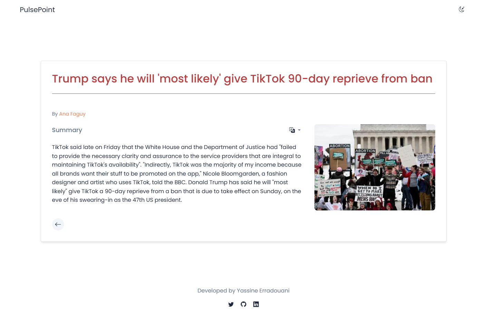

# 📰 PulsePoint

> A Flask web application that transforms lengthy news articles into concise, readable summaries using AI, with multi-language translation support.



## Features

- 🚀 **News Scraping**: Extract content from news article URLs
- 📝 **AI Summarization**: Generate concise summaries of articles
- 🌐 **Multi-language Translation**: Translate summaries to different languages
- 🎨 **Modern UI**: Clean, responsive design with dark/light mode toggle
- 📱 **Mobile Friendly**: Optimized for all device sizes

## Project Structure

```
PulsePoint/
├── main.py                   # Production entry point
├── src/
│   └── app.py               # Development entry point
├── api/
│   ├── index.py             # API routes (Vercel)
│   └── services/
│       ├── news_scraper.py  # Web scraping service
│       ├── summarizer.py    # AI summarization service
│       └── translator.py    # Translation service
├── templates/
│   ├── base.html            # Base template
│   ├── index.html           # Homepage
│   └── summary.html         # Summary display
├── static/
│   ├── css/
│   │   └── styles.css       # Application styles
│   └── js/
│       └── main.js          # Client-side JavaScript
├── tests/
│   ├── test_app.py          # Application tests
│   └── test_flow.py         # Flow tests
└── requirements.txt         # Python dependencies
```

## Local Development

1. Clone the repository:
   ```bash
   git clone <repository-url>
   cd PulsePoint
   ```

2. Install dependencies:
   ```bash
   pip install -r requirements.txt
   playwright install chromium
   ```

3. Run locally:
   ```bash
   # Development mode
   python src/app.py
   
   # Production mode
   python main.py
   ```

## Deployment

### Deploy to Railway (Recommended)

Railway is a modern deployment platform that's perfect for Flask applications.

1. **Sign up for Railway**:
   - Go to [railway.app](https://railway.app)
   - Sign up with your GitHub account

2. **Deploy your repository**:
   - Click "New Project"
   - Select "Deploy from GitHub repo"
   - Choose your PulsePoint repository
   - Railway will automatically detect it's a Python project

3. **Configure Environment Variables**:
   - In your Railway project dashboard, go to "Variables"
   - Add the following environment variables:
     ```
     SECRET_KEY=your-secure-secret-key-here
     FLASK_ENV=production
     ```

4. **Deploy**:
   - Railway will automatically build and deploy your application
   - Your app will be available at: `https://your-app-name.railway.app`

### Alternative: Deploy to Render

1. **Sign up for Render**:
   - Go to [render.com](https://render.com)
   - Sign up with your GitHub account

2. **Create a new Web Service**:
   - Click "New +" and select "Web Service"
   - Connect your GitHub repository
   - Use these settings:
     - **Build Command**: `pip install -r requirements.txt`
     - **Start Command**: `gunicorn --bind 0.0.0.0:$PORT main:app`
     - **Environment**: `Python 3`

3. **Configure Environment Variables**:
   - Add environment variables:
     ```
     SECRET_KEY=your-secure-secret-key-here
     FLASK_ENV=production
     ```

### Alternative: Deploy to Heroku

1. **Install Heroku CLI**:
   ```bash
   # Windows (using chocolatey)
   choco install heroku-cli
   
   # Or download from https://devcenter.heroku.com/articles/heroku-cli
   ```

2. **Deploy to Heroku**:
   ```bash
   heroku create your-app-name
   heroku config:set SECRET_KEY=your-secure-secret-key-here
   heroku config:set FLASK_ENV=production
   git push heroku main
   ```

## Environment Variables

Create a `.env` file for local development:

```env
SECRET_KEY=your-secret-key-for-development
PORT=5000
FLASK_ENV=development
FLASK_DEBUG=True
```

## Production Considerations

- **Playwright**: The app uses Playwright for web scraping. Most cloud platforms support it, but you may need to install additional dependencies.
- **Memory**: Web scraping can be memory-intensive. Consider using platforms with at least 512MB RAM.
- **Security**: Always use a strong `SECRET_KEY` in production.

## Troubleshooting

### Common Issues

1. **Playwright Installation**: 
   ```bash
   playwright install chromium
   ```

2. **Missing Dependencies**:
   ```bash
   pip install -r requirements.txt
   ```

3. **Port Issues on Windows**:
   - Use the provided `run_app.py` script
   - Or run with specific settings: `python main.py`

## Technology Stack

- **Backend**: Flask (Python)
- **Frontend**: HTML, CSS, JavaScript
- **Web Scraping**: Playwright, BeautifulSoup
- **AI/NLP**: Custom summarization algorithms
- **Translation**: Custom translation service
- **Deployment**: Railway/Render/Heroku compatible

## Contributing

1. Fork the repository
2. Create a feature branch
3. Make your changes
4. Test thoroughly
5. Submit a pull request

## License

This project is open source and available under the MIT License.
